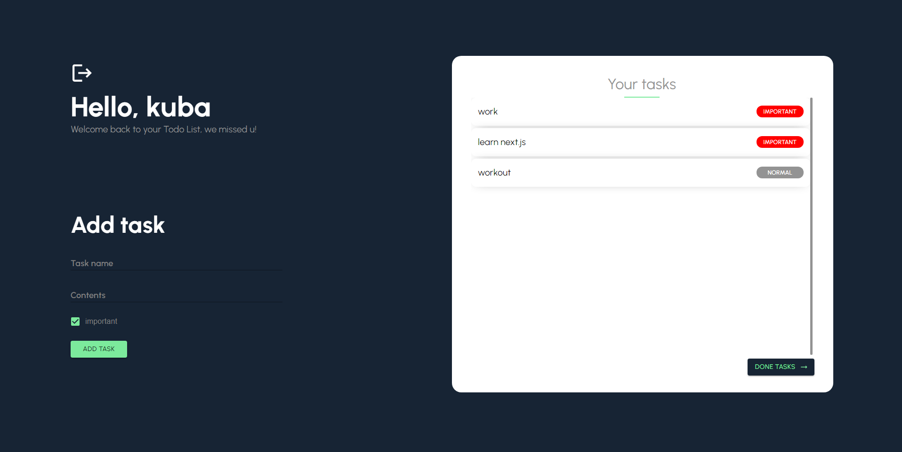
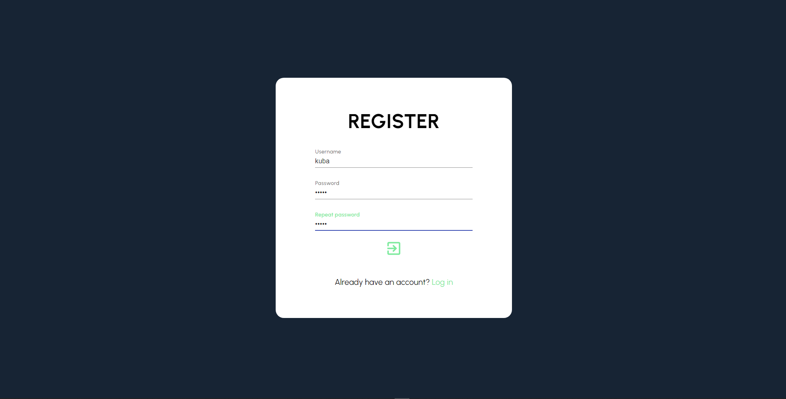

## CHECK IT ONLINE!

soon...

<p align="center">
  <h3 align="center">TypeScript Todo</h3>

  <p align="center">
    A Todo App using Typescript, React, Redux and Realtime updates with Cloud Firestore.
    <br />
  </p>
</p>


<br>

<br>

## About The Project

<p align="center">

</p>

### Installing

Clone the Repository and run

```
npm install
npm start
```

### Built With

-  React
-  TypeScript
-  Firebase
-  Cloud Firestore
-  Redux
-  Styled-Components
-  Material UI
-  React-hook-form

Design inspired by <a href='https://www.instagram.com/joeel56/'>joeel56</a>
